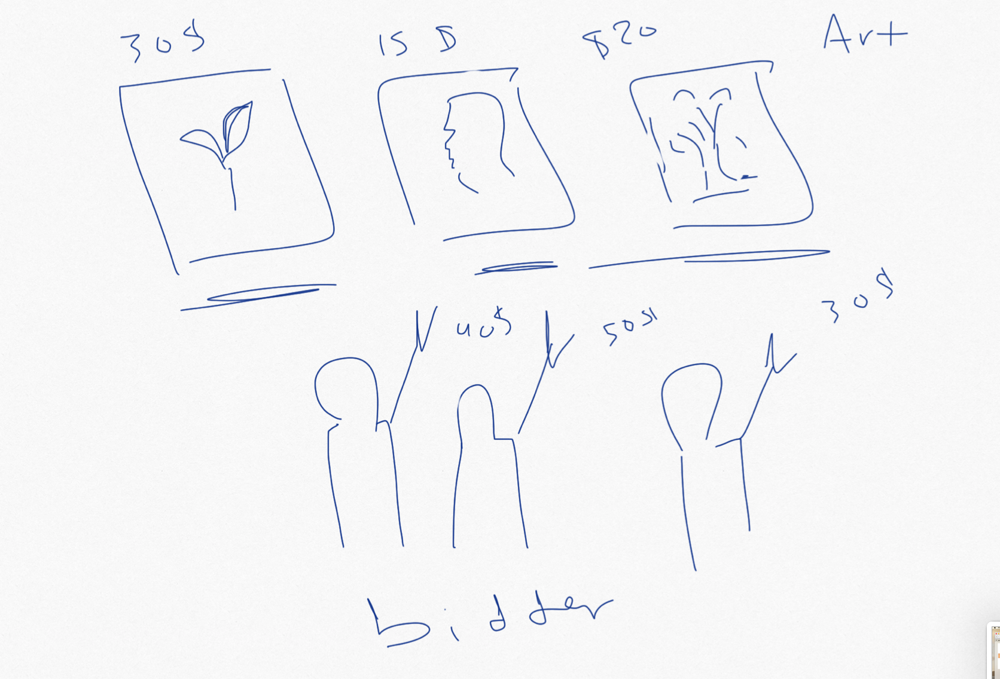

## User Story :
Art Gallery full-stack web application,the client can share their art via the website delete or edit, also they can sell their art.

 ## Part One :

## Backend with Express&&MongoDB:
 
 [] 
 - create models && set up the relations. 
 - finished from the crud for the backend .  
 - test on the functionality with the postman.   
 - setup authentication .
 
 ## Part Tow :
 
 ## Frontend with React. 
  - connect the back end with front end by API set up Axios. 
  - finished from the crud for the frontend.   
  - setup authentication.
  ## part three :
  - test the functionality React.
  -  style with  bootstrap && MDBS CSS.

## Resource
  https://reactjs.org/
  https://mdbootstrap.com/

 

